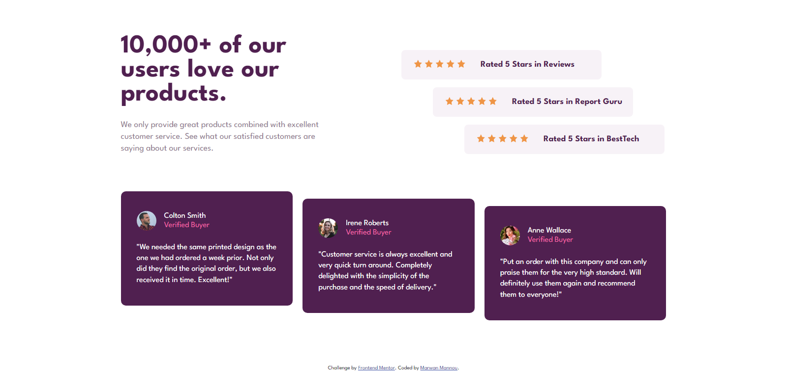

# Frontend Mentor - Social proof section solution

This is a solution to the [Social proof section challenge on Frontend Mentor](https://www.frontendmentor.io/challenges/social-proof-section-6e0qTv_bA). Frontend Mentor challenges help you improve your coding skills by building realistic projects. 

## Overview

### The challenge

Users should be able to:

- View the optimal layout for the section depending on their device's screen size

### Screenshot



### Links

- Live Site URL: [Add live site URL here](https://your-live-site-url.com)

## My process

### Built with

- Semantic HTML5 markup
- CSS custom properties
- Flexbox
- CSS Grid

### What I learned

This challenge made me familiare with grid and flexbox layouts (using span):

```css
.reviews-list{
  grid-column-start: 4;
  grid-column-end: 6;
}
```

### Useful resources

- [Kevin Powell video](https://www.youtube.com/watch?v=rg7Fvvl3taU&t) - This video helped me understand grid layouts more.
